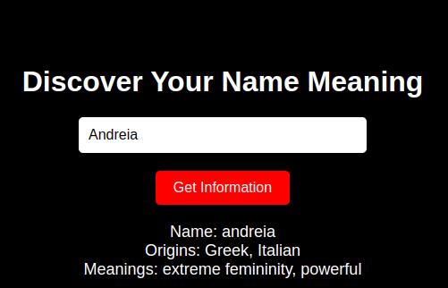

# Name Meaning Lookup 🔍

An application that allows users to discover the meanings and origins of given names and translates this information into English. The project utilizes APIs for information retrieval and translation, combined with an interactive front-end.
## **APIs Used**

### **1. MyMemory Translation API**
- **Description**:
  - A free API for text translation.
  - Translates data retrieved from the Flask API from Portuguese to English.
- **Endpoint**: 
  - [https://api.mymemory.translated.net/get](https://api.mymemory.translated.net/get)
- **Key Parameters**:
  - `q`: The text to be translated.
  - `langpair`: The source and target languages (e.g., `pt|en`).
  - `ie` and `oe`: Input and output encoding, both set to `UTF-8`.

---

### **2. Flask API (Names and Meanings)**
- **Description**:
  - An API developed in Flask that returns information about given names, such as:
    - **Origin**: A list of the name's origins.
    - **Meanings**: A list of meanings.
- **Endpoint**: 
  - [https://nomes-r4jvnvend-marcios-projects-4d42dc06.vercel.app/api/<name>/](https://nomes-r4jvnvend-marcios-projects-4d42dc06.vercel.app/api/<name>/)
- **Technologies Used**:
  - **Flask**: Framework for building APIs.
  - **BeautifulSoup**: Data extraction from HTML pages.
  - **Requests**: HTTP requests for the back-end.

---

## **How It Works**

1. The user enters a name in the input field.  
2. The front-end queries the Flask API to retrieve the origins and meanings of the name.  
3. The data is sent to the MyMemory API for translation from Portuguese to English.  
4. The translated result is displayed in the browser.  

---

## **Contribution**
Feel free to open issues or submit pull requests. Feedback is always welcome!
